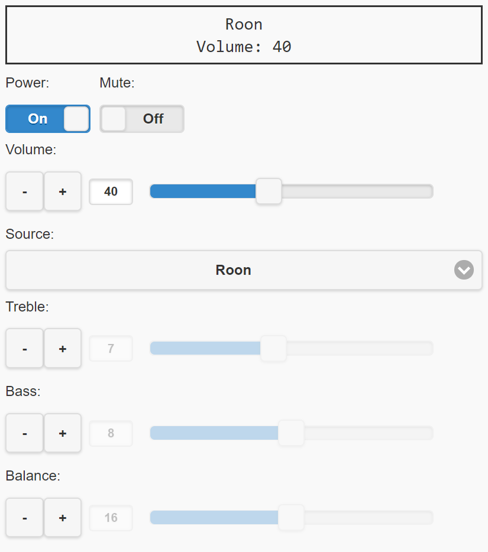

Parasound Zpre3 Web Client 
================

If you have a Parasound Zpre3 or maybe other Parasound with RS232 interface, you can control the device with a simple web interface. Huge props for the work done on https://github.com/claes/rotel-web-client, which I use for my Rotel RC-1570 and inspired me to make a version that works for my Zpre3. 

The setup for this is Raspberry Pi (running Ropieee) and an FTDI USB-to-RS232 with the eventual goal of having full automated control via Roon.

===========================================

*Instructions*

Connect the Parasound preamp with a serial cable to a computer. Check what serial port device it creates (for example "/dev/ttyUSB0").

On the computer, download and start the serial-port-json-server service: https://github.com/chilipeppr/serial-port-json-server/releases
This software you can download pre-compiled for a multitude of computer architectures.
It exposes the serial port as a websocket, accessible for example from Javascript in a HTML page.

The web page and its javascript resources are best served from a http server so you can access it from your home network.
I put them in a /opt/RoPieee/webpage/static directory on my Raspberry Pi running Ropieee, taking advantage of Ropieee's web server.
And then access it from  http://my-address-here/static/zpre3-web-client

Adjust the zpre3Config.js file in this project and update the setting "websocketUrl" to refer to the address of the serial-port-json-server service. 
You also want to adjust the setting "serialPortDevice" if it differs from the default '/dev/ttyUSB0'.

Load index.html in your web browser. The javascript loaded by this page will connect to the serial-port-json-server and through it communicate with the Parasound preamp. Now you can control power, volume, source, balance and tone controls. 
The communication is bi-directional, so if you change the volume using the volume knob on the preamp or the regular remote, the web interface will reflect that.

*Tips*

By adjusting the config properties in zpre3Config.js, you can name your music sources ("TV", "Chromecast" etc). Label properties set to null will be disabled.

*Problems* 

The project is tested with Parasound Zpre3. Not all Parasound equipment implements the same protocol. See https://parasound.com/downloads/default.php for protocol specifications for different models. 

On slower computers, such as the Raspberry Pi first versions, communication sometimes slows down. Suspected cause is gc pauses. 
You can try to tweak the gc options of serial-port-json-server (see its documentation). Newer versions of Raspberry Pi supposedly does not suffer from this, according to serial-port-json-server documentation.

